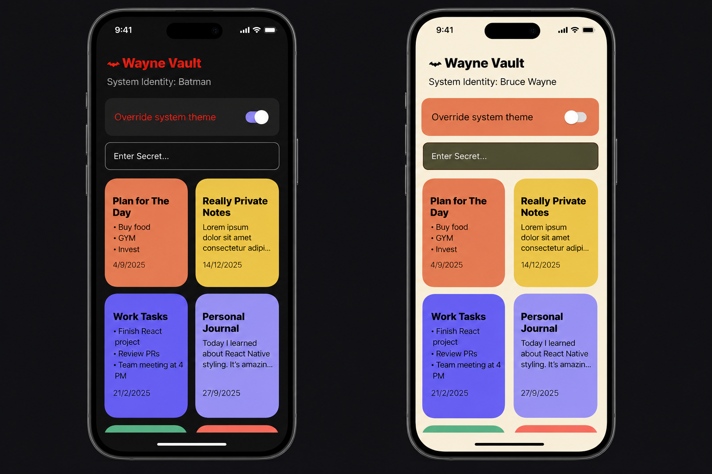
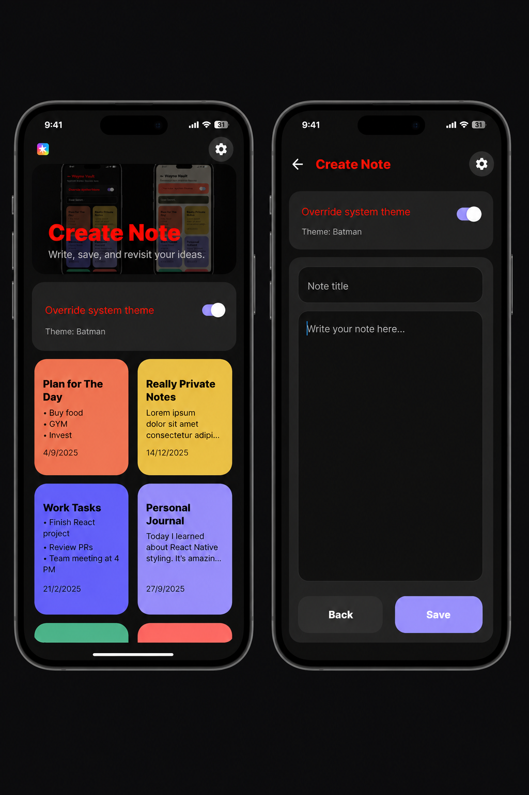

# Wayne Vault

Build a simple and clean Notes App UI using React Native with Expo.

The goal of this assignment is to practice:

- React Native core components
- layout building
- responsive mobile UI design
- dark/light theme handling
- input handling
- clean styling practices

You are required to create 2 separate views/screens UI for the Notes App. You do not need to implement actual navigation between screens.

## What I have done so far

- Built the notes listing view UI for `Home_view_1`
- Added a scrollable card-based layout using `FlatList`
- Added search/filter input
- Added theme toggle support for dark and light mode
- Kept the layout responsive and clean

## Image Preview

